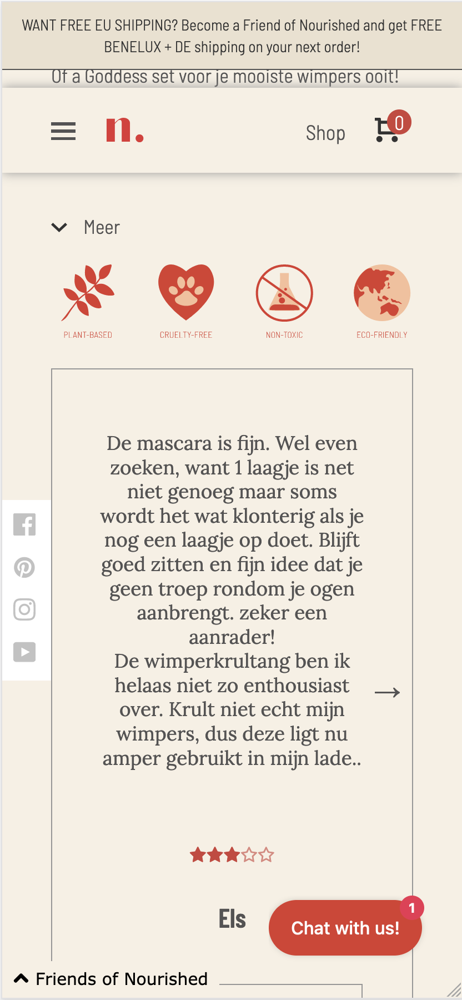

# Procesverslag
Markdown is een simpele manier om HTML te schrijven.  
Markdown cheat cheet: [Hulp bij het schrijven van Markdown](https://github.com/adam-p/markdown-here/wiki/Markdown-Cheatsheet).

Nb. De standaardstructuur en de spartaanse opmaak van de README.md zijn helemaal prima. Het gaat om de inhoud van je procesverslag. Besteedt de tijd voor pracht en praal aan je website.

Nb. Door *open* toe te voegen aan een *details* element kun je deze standaard open zetten. Fijn om dat steeds voor de relevante stuk(ken) te doen.

## Jij

uitwerken voor kick-off werkgroep

### Auteur:
Hannah Hensen

#### Je startniveau:
Blauw

#### Je focus:
surface plane
 

## Je website

uitwerken voor kick-off werkgroep

### Je opdracht:
<a href="http://nourished.nl">Nourished</a>

#### Screenshot(s) van de eerste pagina (small screen): 
Home

#### Screenshot(s) van de tweede pagina (small screen):
hier de naam van de pagina  

 

## Breakdownschets (week 1)

uitwerken na afloop 2e werkgroep

### de hele pagina: 

## Voortgang 1 (week 2)

uitwerken voor 1e voortgang

### Stand van zaken
Hier was ik begonnen met de HTML. Ik had de afbeeldingen die ik wilde gebruiken opgeslagen en verwerkt in de HTML

### Verslag van meeting
Ik had hier weinig feedback, volgens mijn groep genootjes zag het er goed uit. 

## Voortgang 2 (week 3)

uitwerken voor 2e voortgang

### Stand van zaken
N.V.T

### Verslag van meeting
N.V.T

## Toegankelijkheidstest (week 4)

uitwerken na test in 8e voortgang

### Bevindingen
N.V.T

#### Titel eerste bevinding
N.V.T

#### Titel tweede bevinding. 
N.V.T

#### Titel volgende bevinding. 
N.V.T

#### Titel nog een bevinding. 
N.V.T

## Voortgang 3 (week 4)

uitwerken voor 3e voortgang

### Stand van zaken
hier dit ging goed & dit was lastig (neem ook screenshots op van delen van je website en code)

### Agenda voor meeting
samen met je groepje opstellen

| student 1      | student 2          | student 3    | student 4        |
| ---            | ---                | ---          | ---              |
| dit bespreken  | en dit             | en ik dit    | en dan ik dat    |
| en dat ook nog | dit als er tijd is | nog een punt | dit wil ik zeker |
| ...            | ...                | ...          | ...              |

### Verslag van meeting
hier na afloop snel de uitkomsten van de meeting vastleggen

- punt 1
- punt 2
- nog een punt
- ...

## Eindgesprek (week 5)

uitwerken voor eindgesprek

### Stand van zaken
Ik was hier nog niet heel ver, ik had een pagina redelijk ver in HTML en CSS alleen nog niks in JS. De 2e pagina had ik niet. 
### Screenshot(s)

## Bronnenlijst

continu bijhouden terwijl je werkt

1. https://nourished.nl/
2. https://intagrate.io/2020/08/how-to-embed-an-instagram-feed-into-any-website/
3. https://www.w3schools.com/howto/howto_js_slideshow.asp
4. https://dev.to/leonardoschmittk/how-to-make-a-star-rating-with-js-36d3
5. https://codepen.io/chrisjonesio/pen/OmzXdd

